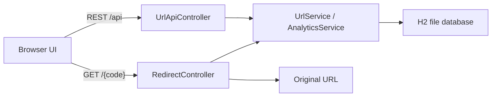

# Shortly — Bitly-style URL Shortener

Full-stack URL shortener built with **Java 17** and **Spring Boot 3**. Create short links, optional custom aliases and expiry dates, then track clicks with a dashboard, QR codes, and per-link analytics.

Open [http://localhost:8080](http://localhost:8080) after the app starts.

## Features

- Shorten long URLs into 7-character Base62 codes
- Custom aliases (`/launch`) with reserved-name protection
- Optional title and expiration datetime
- 302 redirect from `/{code}` to the original URL
- Click tracking: time, IP, referrer, device, browser
- Dashboard totals plus a 14-day click chart
- QR code PNG for every short link
- Search, copy, and delete from the links library
- File-based H2 database (data survives restarts)
- Seeded demo links on first run

## Tech stack

| Layer | Choice |
| --- | --- |
| Backend | Spring Boot 3.3, Spring Web, Spring Data JPA, Validation |
| Frontend | Thymeleaf pages, vanilla JS, Chart.js |
| Database | H2 (file: `./data/bitlydb`) |
| QR codes | ZXing |
| Tests | JUnit 5 + Mockito |

## Architecture



## Prerequisites

- **JDK 17 or newer**
- **Apache Maven 3.9+**

If `java` or `mvn` is not recognized, install a JDK. Maven Wrapper (`mvnw`) is included, so a global Maven install is optional.

**Windows (winget):**

```powershell
winget install EclipseAdoptium.Temurin.17.JDK
```

Then point `JAVA_HOME` at the JDK folder (no trailing `\` and not the `bin` folder):

```powershell
setx JAVA_HOME "C:\Program Files\Eclipse Adoptium\jdk-17.0.20.101-hotspot"
```

Close and reopen the terminal after `setx`. Confirm with `echo %JAVA_HOME%` and `java -version`.

If `.\mvnw.cmd` still says JAVA_HOME is not defined correctly, use the project launcher instead:

```bat
.\run.cmd
```

## Run the app

From this project folder:

```bash
# Windows (recommended if JAVA_HOME is missing)
.\run.cmd

# Windows
.\mvnw.cmd spring-boot:run

# macOS / Linux
./mvnw spring-boot:run
```

Or build a jar and run it:

```bash
.\mvnw.cmd clean package
java -jar target/bitly-url-shortener-1.0.0.jar
```

Then open:

| Page | URL |
| --- | --- |
| Home / shorten | http://localhost:8080 |
| All links | http://localhost:8080/links |
| Analytics | http://localhost:8080/stats/{code} |
| H2 console | http://localhost:8080/h2-console |

H2 console login:

- JDBC URL: `jdbc:h2:file:./data/bitlydb`
- User: `sa`
- Password: *(leave empty)*

Change the public origin used in short links and QR codes in `src/main/resources/application.properties`:

```properties
app.base-url=http://localhost:8080
```

## Try it

1. On the home page, paste a long URL (scheme is optional — `example.com` becomes `https://example.com`).
2. Optionally add a title, custom alias, and expiry.
3. Copy the short URL or open it in a new tab. You should land on the original site.
4. Open **My links** → **Stats** to see clicks, devices, browsers, referrers, and a QR code.
5. First launch seeds three demo links: `/spring`, `/wiki`, and a random-style `/demo7k`.

## REST API

Base URL: `http://localhost:8080/api`

### Create a short URL

```http
POST /api/urls
Content-Type: application/json

{
  "originalUrl": "https://spring.io",
  "title": "Spring",
  "customAlias": "spring-home",
  "expiresAt": "2026-12-31T23:59:00"
}
```

`customAlias` and `expiresAt` are optional. Alias rules: 3–30 characters, letters, numbers, `_`, or `-`.

### List / get / delete

```http
GET    /api/urls
GET    /api/urls/{code}
DELETE /api/urls/{code}
```

### Analytics and QR

```http
GET /api/urls/{code}/analytics
GET /api/urls/{code}/qr
GET /api/stats/summary
```

### Redirect

```http
GET /{code}    →  302 Location: original URL
```

Unknown codes return **404**. Expired links return **410**.

## Project structure

```
src/main/java/com/soham/bitly/
  BitlyApplication.java
  config/          CORS + first-run demo data
  controller/      Pages + 302 redirect
  controller/api/  REST endpoints
  dto/             Request/response models
  entity/          ShortUrl, ClickEvent
  exception/       API error handling
  repository/      Spring Data JPA
  service/         Shorten, track, analytics, QR
src/main/resources/
  application.properties
  templates/       Thymeleaf pages
  static/          CSS, JS, favicon
src/test/java/     Unit tests
```

## Tests

```bash
.\mvnw.cmd test
```

## Optional: MySQL instead of H2

1. Create a database named `bitly`.
2. Add the MySQL driver to `pom.xml`.
3. Replace the datasource settings:

```properties
spring.datasource.url=jdbc:mysql://localhost:3306/bitly
spring.datasource.username=root
spring.datasource.password=your-password
spring.datasource.driverClassName=com.mysql.cj.jdbc.Driver
spring.jpa.hibernate.ddl-auto=update
```

## License

MIT — use and modify freely for learning or production.
